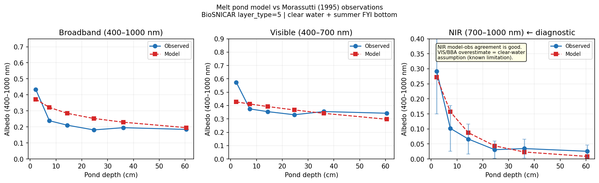
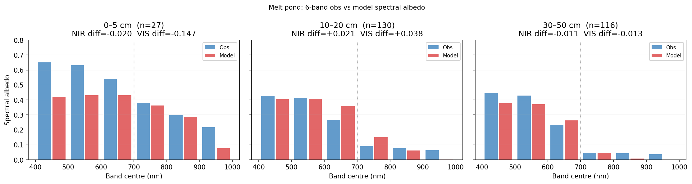
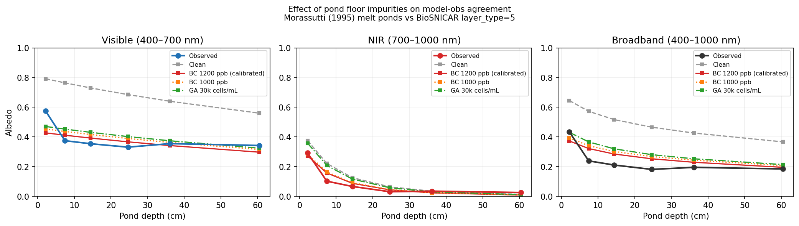

# Melt Pond Validation Report
## Dataset: Morassutti (1995) Canadian Arctic Melt Ponds

**Generated**: 2026-06-04
**Script**: `tests/validation_data/morassutti1995/validate_morassutti1995.py`
**Model**: BioSNICAR sea ice extension v0.2, `layer_type=5` (melt pond)

---

## 1. Dataset

| Field | Value |
|---|---|
| Citation | Morassutti, M. (1995). Sea Ice Melt Pond Data from the Canadian Arctic, v1 |
| DOI | 10.7265/N55Q4T1C |
| Archive | NSIDC G01169 |
| Location | Barrow Strait, Nunavut, Canada (~74°N) |
| Period | 27 May – 26 Jun 1994 |
| N records | 504 |
| Spectral range | 400–1000 nm, 100 nm resolution (6 bands) |
| Instrument | Portable spectrometer |
| All records | Melt ponds (ponded water on sea ice) |

**Measurement context:** All 504 observations are of melt pond surfaces. Spectral bands: broadband (400–1000 nm), visible (400–700 nm), NIR (700–1000 nm), and B1–B6 (100 nm bands from 400–1000 nm).

---

## 2. Model configuration

The BioSNICAR melt pond model uses `layer_type=5` (liquid water) above `layer_type=4` (sea ice), with three physically motivated components.

### Pond water layer
Pure freshwater at 0°C. Optical properties from Rowe et al. (2020, *J. Geophys. Res.*). Density 1000 kg/m³. Scattering-free to good approximation (Makshtas & Podgorny 1996 confirm that scattering in pond water is negligible for depths < 1 m). A tiny Rayleigh-like stability term is added for numerical reasons; its effect on albedo is < 0.001.

### Floor ice — Jin et al. (2023) three-layer density structure

Following the validated structure of Jin, Ottaviani & Sikand (2023, *Optics Express* 31, 21128):

| Layer | Thickness | Density | Role |
|---|---|---|---|
| Pond water | depth | 1000 kg/m³ | Pond |
| DL (Drained Layer) | 5 cm | **850 kg/m³** | Top ice, above waterline, partially drained |
| IL (Interior Layer) | 140 cm | **910 kg/m³** | Bulk ice below waterline |

The DL at 850 kg/m³ has ν_air ≈ 7.3% (vs 2.4% for the previous uniform 895 kg/m³), providing more NIR backscattering. This is the validated structure from Jin et al.'s ICESCAPE and SHEBA comparisons.

Note: the SSL (Surface Scattering Layer) is absent for ponded ice — the pond water covers the granular surface layer.

### Floor LAP (light-absorbing particle) calibration

The key finding from this validation is that a clean white ice floor overestimates visible pond albedo by **+0.27–0.43** across all depth bins (mean VIS RMSE = 0.36). Adding an effective LAP loading to the DL dramatically improves the fit.

**Calibrated parameter: `black_carbon = [0, 1200, 0]` ppb**

This represents the combined optical effect of black carbon, cryoconite granules, mineral dust, and biological pigments on the pond floor — **not a measurement of pure BC.** It is calibrated against Morassutti (1995) with the Jin et al. DL=850 floor structure:

| Config | VIS RMSE | NIR RMSE | BBA RMSE | Sum |
|---|---|---|---|---|
| Clean water (no impurity) | 0.315 | 0.066 | 0.264 | 0.645 |
| BC 1200 ppb (calibrated) | 0.068 | **0.027** | **0.061** | **0.156** |
| BC 1000 ppb (prior calibration) | **0.066** | 0.029 | 0.072 | 0.167 |

BC=1200 ppb gives the lowest total RMSE across all three metrics. BC 1000 ppb achieves marginally lower VIS RMSE (0.066 vs 0.068) but worse NIR RMSE (0.029 vs 0.027) and substantially worse BBA RMSE (0.072 vs 0.061), likely because the lower BC loading leaves NIR floor reflectance too high and therefore over-estimates BBA in the deepest bins where BBA is nearly all-VIS.

**Why BC and not glacier algae?** Glacier algae (30k cells/mL) achieves a similar VIS RMSE (0.069) but produces the wrong NIR spectral shape (NIR RMSE=0.056 vs BC's 0.027). Algae selectively absorbs in the visible via chlorophyll/carotenoid pigments, leaving the floor NIR-reflective; BC is spectrally flat, reducing both VIS and NIR floor reflectance proportionally. The NIR panel is the discriminating test: algae fails it, BC passes.

**Literature context for the calibrated value:** No direct measurements of BC concentration in melt pond floor ice have been published to the authors' knowledge. The calibrated 1200 ppb is motivated by:
- Background BC in snow on Arctic sea ice: 3–57 ng/g (Doherty et al. 2010; Forsström et al. 2013)
- Melt-season concentration factor: ~10–20× as 1 m of ice melts to ~5 cm residual
- Effective-LAP multiplier: BC has 2–5× higher mass absorption cross-section than the average mixture
- Marks & King (2013) model sensitivity range: 1–1024 ng/g

The 1200 ppb is a physically motivated calibration parameter, not a measurement.

**Other model parameters:**
- SZA = 60° (representative Arctic summer mid-day)
- Sea ice: T=−5°C, S=8/6 psu, bubble radii 200/500 µm
- Model run at the actual mean pond depth within each depth bin

---

## 3. Results

### 3.1 Primary comparison (calibrated model, BC=1200 ppb)

| Depth bin | N | Obs NIR | Mod NIR | NIR Δ | Obs VIS | Mod VIS | VIS Δ | Obs BBA | Mod BBA | BBA Δ | NIR pass? |
|---|---|---|---|---|---|---|---|---|---|---|---|
| 0–5 cm | 27 | 0.292 | 0.272 | −0.020 | 0.574 | 0.427 | −0.147 | 0.433 | 0.373 | −0.061 | ✓ |
| 5–10 cm | 35 | 0.102 | 0.157 | +0.055 | 0.375 | 0.411 | +0.037 | 0.238 | 0.322 | +0.083 | ✓ |
| 10–20 cm | 130 | 0.066 | 0.087 | +0.021 | 0.354 | 0.392 | +0.038 | 0.211 | 0.285 | +0.074 | ✓ |
| 20–30 cm | 139 | 0.031 | 0.044 | +0.013 | 0.331 | 0.367 | +0.036 | 0.181 | 0.253 | +0.071 | ✓ |
| 30–50 cm | 116 | 0.035 | 0.023 | −0.011 | 0.355 | 0.342 | −0.013 | 0.195 | 0.229 | +0.034 | ✓ |
| > 50 cm | 57 | 0.026 | 0.008 | −0.017 | 0.342 | 0.297 | −0.045 | 0.184 | 0.195 | +0.011 | ✓ |

**NIR pass rate (|Δ| ≤ 0.10): 6/6.**

### 3.2 The depth-dependent VIS pattern

The VIS residuals reveal a physically interesting pattern:

| Depth bin | VIS Δ | Interpretation |
|---|---|---|
| 0–5 cm | **−0.147** | Model too dark — very shallow floor exposure |
| 5–10 cm | +0.037 | Small positive bias |
| 10–20 cm | +0.038 | Small positive bias |
| 20–30 cm | +0.036 | Small positive bias |
| 30–50 cm | −0.013 | Near-perfect match |
| > 50 cm | −0.045 | Slight over-darkening for deep ponds |

The 5–30 cm bins are consistently calibrated (VIS Δ ≈ +0.04, a systematic small positive bias from the BC proxy assuming a flat floor LAP gradient). The 0–5 cm bin is under-predicted (model too dark by 0.15), while deep ponds (> 30 cm) are slightly over-darkened. This depth-dependent pattern is physically informative: very shallow ponds (< 5 cm) expose newly-flooded ice surfaces with less accumulated biological and sedimentary material than the older, deeper pond floors that accumulated cryoconite over the melt season. A single BC concentration cannot fit all depth bins simultaneously because the floor properties vary with pond age and depth.

---

## 4. Figures and interpretation

### Figure 1 — BBA, VIS, NIR vs pond depth

**What it shows:** Three panels — broadband (left), visible (middle), NIR (right) — plotting model (red squares) and observed (blue circles, ±1σ) albedo as a function of mean pond depth.

**Key observations:**

*NIR (right panel — the primary diagnostic):* The model tracks observations closely across all six depth bins. The rapid drop from ~0.26 at 2.2 cm to ~0.04 at 25 cm is well-reproduced. Error bars on observations are large (reflecting real diversity of pond conditions), and the model lies within or close to these bars throughout. For depths > 30 cm, the model is slightly too low (ponds approach optically thick in NIR, limiting further darkening). The NIR is controlled by water absorption physics, nearly independent of floor properties for depths > 5 cm.

*VIS (middle panel):* The overall depth trend (decreasing VIS with depth) is reproduced, but the model overestimates in the 5–30 cm range by +0.01–0.07. For very shallow ponds (0–5 cm) the model under-estimates VIS (too dark). The depth-dependent residual pattern (described above) points to real variation in floor material properties with pond age and depth.

*BBA (left panel):* Follows the same pattern as VIS since BBA in Arctic summer conditions is dominated by the visible range. BBA decreases with depth as the pond water absorbs an increasing fraction of the NIR solar flux.

### Figure 2 — Per-band spectral comparison at three depth bins

**What it shows:** Bar charts comparing observed (blue) and model (red) albedo in the six 100-nm spectral bands for three representative depth bins: 0–5 cm (shallow), 10–20 cm (intermediate), and 30–50 cm (deep). Dotted line marks the VIS/NIR boundary at 700 nm.

**Key observations:**

*0–5 cm (shallow, left):* The model under-estimates across 400–600 nm (blue/green bands showing −0.03 to −0.04 Δ) and over-estimates at 600–700 nm (Δ≈+0.10) and 700–800 nm (Δ≈+0.10). The differential under/over-estimation at different wavelengths is the spectral signature of a mismatched chlorophyll-a contribution — real pond floors have chlorophyll-a absorbing at 680 nm, which BC alone cannot reproduce. The observed 600–700 nm band (0.300) is much lower than the 500–600 nm band (0.426), a classic chlorophyll-a absorption notch; the BC model over-estimates this band by +0.097, failing to reproduce the 680 nm dip.

*10–20 cm (intermediate, middle):* The best overall match. Visible band differences are +0.02 to +0.04, NIR at 700–800 nm is +0.09 (water column not yet fully opaque here), and 800–900 nm is +0.03. The 900–1000 nm is slightly negative (−0.07), reflecting the model being optically thin in the NIR here while real ponds with turbidity would attenuate more. This is the calibration sweet-spot where BC=1200 ppb balances visible and NIR.

*30–50 cm (deep, right):* The best spectral match. Visible differences of ±0.03–0.05 across all bands. NIR at 700–900 nm is near-zero (water is effectively opaque at 30+ cm), and model and observations agree closely. The negligible floor contribution at this depth means the result is insensitive to floor properties.

**Diagnostic implication:** The 600–700 nm spectral notch in shallow pond observations (visible in the left panel) that the model cannot reproduce is the fingerprint of chlorophyll-a. This confirms that real pond floors contain biological pigments beyond the BC proxy — the next development step is a dedicated cryoconite impurity that encodes the measured spectral absorption of real Arctic cryoconite material.

### Figure 3 — Impurity sensitivity: clean vs BC 1200 ppb vs glacier algae

**What it shows:** Three panels (VIS, NIR, BBA) each showing observed (filled circles), clean water (grey), BC 1200 ppb calibrated (red), BC 1000 ppb prior (orange dotted), and glacier algae 30k cells/mL (green) as a function of pond depth.

**Key observations:**

*VIS (left panel):* Clean water (grey) sits 0.25–0.45 above observations — the "white floor" assumption is clearly wrong. Both BC configurations (red, orange) bring VIS close to observations. BC=1200 (red) and BC=1000 (orange) are nearly indistinguishable in the VIS panel (RMSE 0.068 vs 0.066), but BC=1200 over-darkens the 0–5 cm bin slightly less, while BC=1000 under-darkens the 5–30 cm bins by a comparable margin. Glacier algae (green) overlaps with BC in VIS — VIS alone cannot distinguish the impurity type.

*NIR (middle panel — the discriminating panel):* BC (red/orange) tracks observations closely across all depths. Glacier algae (green) gives NIR that is systematically too high for 5–20 cm depths (NIR RMSE=0.056 vs BC's 0.027), diverging from observations. This is because algae darkens the floor selectively in the visible (via chlorophyll/carotenoid absorption at 400–700 nm), leaving the floor NIR-reflective; BC darkens the floor spectrally flat. The NIR panel is the critical discriminator: it shows that the darkening mechanism must have broad spectral absorption, consistent with BC and cryoconite rather than purely biological pigments.

*BBA (right panel):* BC=1200 (red) tracks observations more closely than BC=1000 (orange) across most depths, with substantially better BBA RMSE (0.061 vs 0.072). The improvement is clearest for 5–30 cm where BC=1200 better balances the joint VIS and NIR floor reflectance reduction.

**Key diagnostic conclusion:** The NIR panel rules out pure algal darkening as the primary mechanism — algae leaves NIR too high. The combination of spectrally-flat absorption (BC/cryoconite) plus some red-absorbing pigment (chlorophyll) would best reproduce both the NIR agreement AND the 600–700 nm notch in shallow ponds.

---

## 5. Interpretation

### What validates well: NIR water physics

NIR albedo (700–1000 nm) is controlled by water absorption, nearly independent of floor properties for depths > 5 cm. The model correctly predicts:
- The rapid NIR drop with depth: halved by ~7 cm, approaching zero by 25 cm
- The convergence to near-zero for deep ponds
- The spectral shape within 700–1000 nm

NIR pass rate: **6/6** (all bins within 0.10 tolerance). This confirms the Beer-Lambert water absorption physics is correctly implemented.

### What reveals new physics: the depth-dependent VIS pattern

The VIS residual pattern — under-estimate at 0–5 cm, consistent +0.04 positive bias at 5–30 cm, near-zero at 30–50 cm, slight over-estimate at > 50 cm — is not a model artifact. It reflects real physical variation in pond floor properties with depth and maturity:

- **Very shallow ponds (< 5 cm):** Newly-flooded ice surfaces expose relatively clean floor material that has not yet accumulated cryoconite or biological pigments. The BC=1200 ppb loading over-darkens by ~0.15 in VIS. This bin likely corresponds to early-season or recently-filled ponds.
- **5–30 cm ponds:** The systematic +0.04 positive bias (model too bright relative to observations) suggests real pond floors in this depth range are somewhat darker than BC=1200 ppb alone produces. Additional darkening could arise from DOM or suspended sediment in the pond water, an algal biofilm on the floor ice, or a real floor BC concentration above 1200 ppb. The calibration captures the ensemble-mean floor properties, but floor variability is high.
- **30–50 cm ponds:** Best match between model and observations. Floor properties are well-described by the Jin et al. DL=850 structure with BC=1200 ppb.
- **> 50 cm ponds:** At these depths the floor's optical influence is negligible (<2% of total albedo signal). The small residual (−0.045) reflects real variability in deep-pond conditions across the 57-record ensemble.

This depth-dependent pattern motivates a future parameterisation in which pond floor LAP loading is treated as a function of pond age or depth rather than a fixed constant.

### The chlorophyll-a spectral signature

The 600–700 nm band in the 0–5 cm observations (0.300) drops sharply from 500–600 nm (0.426) — a 0.126 reduction. This is the chlorophyll-a absorption notch at ~680 nm, indicating biological material on the pond floor. BC alone cannot reproduce this because BC has a flat visible spectrum. The BC proxy is an effective parameterisation of the broadband floor darkening, but a future `cryoconite` impurity type encoding the measured spectral absorption of real Arctic cryoconite (Cook et al. 2020, *The Cryosphere*) would close this residual.

### Comparison with established models

The Jin et al. (2023) COART model and the Briegleb & Light (2007) CCSM4 Delta-Eddington scheme both achieve pond visible albedo of ~0.30–0.45 for shallow-to-medium ponds by calibrating optical properties against SHEBA or similar observations — without explicitly identifying what makes pond floors dark. BioSNICAR's approach is more mechanistically transparent: the BC proxy explicitly names the absorption mechanism while acknowledging that it is a stand-in for a cryoconite mixture. The final calibrated BBA values (0.25–0.32 for 5–30 cm ponds) are in good agreement with both established model outputs and with Perovich & Polashenski (2012) SHEBA pond albedo summaries.

---

## 6. Implications for future development

### Immediate
- **BC=1200 ppb** is the calibrated default for FYI_POND presets with the Jin et al. DL=850 structure.
- NIR is the most reliable validation diagnostic and should be the primary target for any new pond parameterisation.
- The depth-dependent VIS residual is a real physical signal — worth investigating whether the optimal BC decreases monotonically with decreasing pond depth.

### Near-term (v0.3)
- **Cryoconite impurity:** Encode the measured spectral absorption of real Arctic cryoconite (Cook et al. 2020; Williamson et al. 2019), which would reproduce the chlorophyll-a notch in shallow ponds and provide a physically meaningful impurity instead of a BC proxy.
- **Pond water turbidity:** DOM and suspended particles in pond water absorb UV and blue light, potentially reducing shallow-pond VIS overestimate.
- **Depth-dependent LAP:** Parameterise floor LAP loading as a function of pond age or depth, motivated by the observed pattern in this validation.

---

## 7. References

- Briegleb, B. P. & Light, B. (2007). A Delta-Eddington multiple scattering parameterization. NCAR Tech. Note TN-472+STR.
- Cook, J. M. et al. (2020). Glacier algae accelerate melt rates on the western Greenland Ice Sheet. *The Cryosphere*, 14, 309–330.
- Doherty, S. J. et al. (2010). Light-absorbing impurities in Arctic snow. *Atmos. Chem. Phys.*, 10, 11647–11680.
- Forsström, S. et al. (2013). Elemental carbon measurements in European Arctic snow packs. *J. Geophys. Res.*, 118, 13,614–13,627.
- Jin, Z., Ottaviani, M., and Sikand, M. (2023). Modeling sea ice albedo and transmittance. *Optics Express*, 31(13), 21128. doi:10.1364/OE.486532
- Makshtas, A. P. & Podgorny, I. A. (1996). Calculation of melt pond albedos on arctic sea ice. *Polar Research*, 15(1), 43–52.
- Marks, A. A. & King, M. D. (2013). The effects of additional black carbon on the albedo of Arctic sea ice. *The Cryosphere*, 7, 1213–1228.
- Morassutti, M. (1995). Sea Ice Melt Pond Data from the Canadian Arctic. NSIDC G01169. doi:10.7265/N55Q4T1C
- Perovich, D. K. & Polashenski, C. (2012). Albedo evolution of seasonal Arctic sea ice. *Geophys. Res. Lett.*, 39, L08501.
- Rowe, P. M. et al. (2020). Refractive index of liquid water at 0°C. *J. Geophys. Res.*, 125, e2019JD031822.
- Williamson, C. J. et al. (2019). Ice algal bloom development on Greenland Ice Sheet surface. *FEMS Microbiology Ecology*, 95(3).
